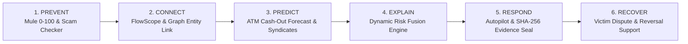

# FraudDNA 360 — Proactive Cyber Fraud Defence & Financial Crime Intelligence Platform

[]()
[]()
[]()
[]()

> **Enterprise-grade, AI-powered cyber fraud intelligence and digital recovery platform.**  
> Seamlessly unified into the 6-layer operational lifecycle:  
> **PREVENT → CONNECT → PREDICT → EXPLAIN → RESPOND → RECOVER**

---

## 1. Important Legal & Operational Disclaimer

> ⚠️ **IMPORTANT COMPLIANCE & SAFETY NOTICE**  
> **FraudDNA 360** is an advanced decision-support intelligence platform built for authorized bank compliance officers, cybersecurity researchers, and law enforcement analysts.  
> - **Simulated Responses**: All inter-bank freezing orders, telecom tower triangulation, and law enforcement notifications within the demonstration environment are marked with `⚠ SIMULATED BANK RESPONSE` / `⚠ DEMO FRAUD DATA`.  
> - **No Autonomous Freezing or Arrests**: The system does **not** autonomously seize real external assets or initiate autonomous physical arrests. All actions generate evidence-grounded packages intended for human review, statutory compliance, and judicial authorization.  
> - **No Guarantee of Fund Recovery**: Asset recovery probabilities are statistical estimates based on temporal velocity and node depth; actual fund recovery depends on counterparty institution cooperation and legal injunctions.

---

## 2. Platform Architecture (The 6 Operational Layers)



### Layer 1: PREVENT — Early Mule Risk & Citizen Threat Intelligence
- **Mule Account Risk Scorecard (0–100)**: Quantitative risk scoring based on dormancy churn, rapid pass-through velocity, odd-hour activity, and high fan-in / high fan-out ratios. Provides itemized reason codes (e.g., `MULE-DORM-01`, `MULE-PASS-02`).
- **Citizen Safety & Scam Checker**: Public-facing triage portal featuring the `"⚠️ I THINK I AM BEING SCAMMED"` instant protocol, suspicious URL & look-alike domain scanner, scam SMS urgency classifier, demo AI voice/deepfake forensics, and Family Emergency alerts.

### Layer 2: CONNECT — Unified Graph Intelligence & FlowScope Money Tracing
- **FlowScope Multi-Hop Tracing**: Reconstructs complete multi-layer fund diversion from initial victim debit through primary mules, secondary layering hops, and ultimate ATM/crypto exit nodes.
- **Circular Flow Detection**: Automatically flags wash-trading loops (e.g., `A → B → C → A`) used to artificially inflate volume or launder funds.
- **Entity Resolution & Extraction**: Ingests raw cybercrime complaints, normalizes phone numbers and UPI IDs, and links cross-bank suspect entities with confidence scoring (`RESOLVED`, `HIGH_CONFIDENCE`, `UNDER_REVIEW`).

### Layer 3: PREDICT — Spatio-Temporal Cash-Out & Campaign Intelligence
- **Spatio-Temporal Cash-Out Forecasting**: Calculates **WHERE** (e.g., *Cluster A - South Delhi Metro Corridor*) and **WHEN** (probable window e.g., *18:00 – 21:00*) syndicate runners will attempt physical ATM cash extraction.
- **Syndicate Campaign Detection**: Groups disparate fraud incidents and mule accounts into coordinated threat clusters (e.g., *Syndicate Hydra-88: Fake Utility Bill Scheme*).

### Layer 4: EXPLAIN — Dynamic Risk Fusion Engine
- **Weighted Multi-Factor Fusion**: Transparent formula combining 5 intelligence dimensions:
  $$\text{Fused Risk} = (w_{ai} \times S_{ai}) + (w_{graph} \times S_{graph}) + (w_{tx} \times S_{tx}) + (w_{beh} \times S_{beh}) + (w_{threat} \times S_{threat})$$
- **Dynamic Slider Controls**: Allows lead compliance officers to adjust weighting in real-time with instant re-normalization.
- **Grounded Evidence Cards**: Natural language explainability breakdown detailing why an account was flagged.

### Layer 5: RESPOND — Fraud Case Autopilot & Cryptographic Chain of Custody
- **One-Click Case Autopilot**: Discovers high-risk signals, expands the connected graph, performs multi-hop money flow tracing, generates grounded executive summaries, and creates a formal investigation case file automatically.
- **Sealed Evidence Packages (SHA-256)**: Cryptographically seals forensic evidence (graph topology, transaction ledger, entity nodes) with a SHA-256 hash stamp for court-admissible audit integrity.
- **Unified Global Search**: Single cross-index search across accounts, cases, transactions, and threat indicators.

### Layer 6: RECOVER — Digital Fraud Recovery & Dispute Lifecycle
- **Victim Transaction Verification Dispute**: Real-time SMS/app notification asking victims to confirm transaction validity:
  - `[THIS TRANSACTION IS LEGITIMATE]` → Logs confirmation and closes alert.
  - `[THIS TRANSACTION WAS NOT AUTHORIZED]` → Instantly triggers emergency containment, logs affidavit timestamp, and opens an expedited recovery case.
- **Multi-Stage Recovery Tracking**: Tracks disputes across 5 formal states (`INITIATED`, `NOTICE_SERVED`, `LIEN_REQUESTED`, `PARTIAL_RECOVERY`, `RESOLVED`).
- **Simulated Partner Bank Generator**: Demonstrates inter-bank messaging with automated mock response generation (`FREEZE_CONFIRMED`, `FUNDS_HELD`).

---

## 3. Technology Stack & Design

| Component | Technologies |
|---|---|
| **Frontend** | React 18, Vite 5, Tailwind CSS, Lucide Icons, Recharts, React Router DOM 6, Axios |
| **Backend** | Node.js (v18+ / v20+), Express.js, REST API, JSON Web Tokens (JWT), Crypto (SHA-256) |
| **Data & Storage** | In-Memory Enterprise MemoryStore fallback (zero database setup needed for instant demo) + optional MySQL connection pool (`mysql2`) |
| **Security & Governance** | Role-Based Access Control (RBAC), Financial PII Masking, Chain-of-Custody SHA-256 evidence sealing |
| **Test Suite** | Native Node.js test runner (`node --test`), 20 automated unit & integration tests |

---

## 4. Role-Based Access Control (RBAC) & Demo Credentials

Switch between evaluator roles instantly using the **Role Switcher** in the top navigation bar, or log in directly:

| Role | Username | Password | Permissions & Views |
|---|---|---|---|
| **Investigator** | `admin_investigator` | `admin123` | Full access to Detection, Mule Risk, FlowScope, Predictions, Risk Fusion, Autopilot, Case Management, and Recovery. |
| **Admin** | `chief_admin` | `admin123` | Master access: All investigator capabilities + Risk Fusion weight reconfiguration, system audit logs, and security governance. |
| **Citizen** | `citizen_user` | `citizen123` | Focused Citizen Safety Portal: Emergency SOS button, Scam SMS Classifier, Phishing URL Scanner, AI Voice Forensics, and Family Alert. |

---

## 5. Quick Start (Zero External Dependencies)

The platform is designed to run **out-of-the-box** with full synthetic enterprise fraud data without requiring external database installation.

### Prerequisites
- Node.js (v18 or v20 recommended)
- npm (v9+)

### 1. Start the Backend API Server
```bash
cd backend
npm install
npm start
```
*Backend API starts on `http://localhost:5000` with the in-memory fallback enabled by default.*

### 2. Run Automated Test Suite
```bash
cd backend
npm test
```
*Executes all 20 automated tests verifying Authentication, Mule 0-100 scoring, FlowScope, Predictions, Risk Fusion, Autopilot, and Recovery.*

### 3. Start the Frontend Application
```bash
cd frontend
npm install
npm run dev
```
*Frontend dev server launches at `http://localhost:5173`.*

---

## 6. End-to-End Demonstration Guide

1. **Sign In**: Navigate to `http://localhost:5173/login` and log in as `admin_investigator`.
2. **Dashboard**: Review the 6 Master KPI Cards:
   - Total Risk Signals: `248`
   - Critical Alerts: `14`
   - Suspicious Networks: `8`
   - High-Risk Mule Accounts: `19`
   - Active Cases: `3`
   - Recovery Cases: `4`
3. **Layer 1 (Mule Risk Scorecard)**: Navigate to `/mule-detection`. Select Mule Account `ACC-44102-MULE-A` and inspect the 0–100 risk gauge, high fan-in/fan-out metrics, and itemized breakdown.
4. **Layer 1 (Citizen Scam Checker)**: Navigate to `/scam-checker`. Test the `"I THINK I AM BEING SCAMMED"` panic protocol, scan a phishing URL (`https://sbi-kyc-update-portal-urgent.top`), and test the OTP scam message classifier.
5. **Layer 2 (FlowScope Money Flow)**: Navigate to `/money-flow`. Observe the 4-stage money trail from victim account `ACC-10921-VIC` through layering hops to ATM Cash-Out `ATM-LOC-SOUTH-01`, with circular flow alerts.
6. **Layer 2 (Entity Resolution)**: Navigate to `/network`. Review the interactive SVG topology graph and inspect the Entity Resolution extraction panel.
7. **Layer 3 (Predictive Forecasts)**: Navigate to `/predictions`. View spatio-temporal ATM cluster forecasts (South Delhi Metro Corridor, 18:00–21:00) and Syndicate Campaign clusters.
8. **Layer 4 (Risk Fusion Engine)**: Navigate to `/risk`. Adjust the dynamic risk weight sliders (AI, Graph, Transaction, Behavior, Threat Intel) and observe explainable evidence cards.
9. **Layer 5 (Fraud Case Autopilot)**: Navigate to `/investigations`. Click **⚡ Run Fraud Case Autopilot** to generate an autonomous case file with a cryptographically verified SHA-256 Evidence Seal.
10. **Layer 6 (Digital Fraud Recovery)**: Navigate to `/recovery`. Test the victim verification dispute simulation (`[THIS TRANSACTION WAS NOT AUTHORIZED]`), review the active recovery queue, and generate simulated partner bank lien responses.

---

## 7. Automated Test Coverage

```text
TAP version 13
# Subtest: FraudDNA 360 - Comprehensive Automated Test Suite
    ok 1 - 1. Authentication & RBAC Governance (3 tests)
    ok 2 - 2. Layer 1: PREVENT - Mule 0-100 & Threat Intel (4 tests)
    ok 3 - 3. Layer 2: CONNECT - FlowScope & Entity Linking (5 tests)
    ok 4 - 4. Layer 3: PREDICT - Spatio-Temporal Cash-Out & Syndicates (2 tests)
    ok 5 - 5. Layer 4: EXPLAIN - Risk Fusion & Weights (2 tests)
    ok 6 - 6. Layer 5: RESPOND - Autopilot & SHA-256 Evidence Seal (2 tests)
    ok 7 - 7. Layer 6: RECOVER - Victim Dispute & Recovery Lifecycle (2 tests)
# tests 20
# suites 8
# pass 20
# fail 0
```

---

## 8. License
Licensed under the Apache 2.0 License. Designed for cybersecurity defense, financial crime intelligence research, and ethical technology demonstration.
